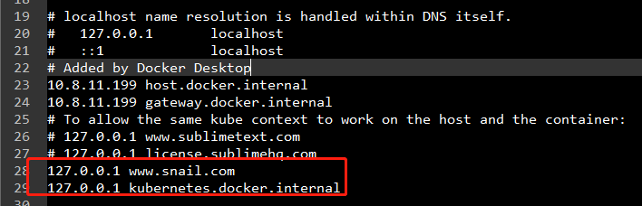
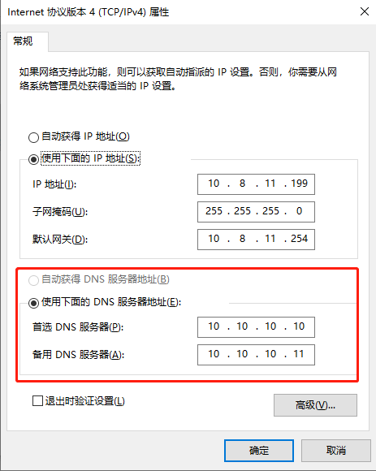

## 1.  URL的访问过程

**关键词**：host

1. 输入网址，例如：www.demo.com


2. 查找本机的host文件，是否存在对应的IP映射，若存在则直接访问

```cmd
C:\Windows\System32\drivers\etc\host
```





3. 否则，继续向DNS服务器查找，找到则直接返回访问，找不到就会出现找不到页面的错误



## 2. 网站目录结构

webapps：服务器的Web目录

​		|—Project1

​		|—Project2：网站目录名

​				|—WEB-INF

​				|		|—web.xml：网站配置文件

​				|		|—classes：java程序

​				|		|—lib: Web应用依赖的jar包

​				|—index.html: 默认首页

​				|—static

​						|—css

​						|—js

​						|—img


## 3. Maven

**关键词**: 约定大于配置、依赖导入


Maven的强大之处在于能够自动导入某个包的所有依赖


Maven的资源导出问题

```xml
<build>
	<!--  资源文件导出，因为maven默认只会从resource目录下寻找资源文件  -->
    <resources>
      <resource>
        <directory>/src/main/resources</directory>
        <excludes>
          <exclude>**/**/*.properties</exclude>
          <exclude>**/**/*.xml</exclude>
          <!--  不过滤上述文件  -->
          <filtering>false</filtering>
        </excludes>
      </resource>
      <resource>
        <directory>src/main/java</directory>
        <excludes>
          <exclude>**/**/*.properties</exclude>
          <exclude>**/**/*.xml</exclude>
          <filtering>false</filtering>
        </excludes>
      </resource>
    </resources>
</build>
```

 

## 4. XML

### 4.1 元素

元素名称不能以xml开头，标签必须闭合，且值不需要加双引号

```xml
<!-- <元素>值</元素> -->
<user>name</user>
```

### 4.2 属性

对元素的描述，一般作为元数据使用，值必须用引号括起来

```xml
<!-- <元素 属性="属性值">值<元素> -->
<id type="string">12345</id>
```

### 4.3 命名空间 

为了解决标签名字重复冲突问题，例如：

```xml
<root>
    <!-- 桌子 -->
    <table>
        <width>60</width>
        <high>90</high>
    </table>

    <!-- 表格 -->
    <table>
    	<rows>60</rows>
        <columns>90</columns>
    </table>
</root>
```


xmlns（XML Namespace）

**注释：**用于标示命名空间的地址不会被解析器用于查找信息。其惟一的作用是赋予命名空间一个惟一的名称。不过，很多公司常常会作为指针来使用命名空间指向实际存在的网页，这个网页包含关于命名空间的信息。

```xml
<!-- 语法 <p xmlns:前缀="url"> -->
<root xmlns:f="http://www.w3school.com.cn/furniture" 
      xmlns:h="http://www.w3.org/TR/html4">
    <!-- 桌子 -->
    <f:table>
        <f:width>60</f:width>
        <f:high>90</f:high>
    </f:table>

    <!-- 表格 -->
    <h:table>
    	<h:rows>60</h:rows>
        <h:columns>90</h:columns>
    </h:table>
</root>
```


**默认命名空间**常用于根节点，作用是该元素内部的子元素都会默认属于该命名空间下， 我们不需要为他们一一添加命名空间前缀

```xml
<!-- <root xmlns="url"></root> -->
<beans xmlns="http://www.springframework.org/schema/beans"></beans>
```


### 4.4 XSD文件

XML Schema Definition，用于定义XML语法的文件，规定一份XML应该有什么元素、属性、默认值、可选值等。xsi已经成为了一个业界默认的用于XSD文件的命名空间，一般会由xsi:schemaLocation元素定义XSD文件的具体位置，例如：

```xml
<!-- 语法 xsi:schemaLocation="键 值" -->
<project xmlns="http://maven.apache.org/POM/4.0.0" 
xmlns:xsi="http://www.w3.org/2001/XMLSchema-instance"
xsi:schemaLocation="http://maven.apache.org/POM/4.0.0 http://maven.apache.org/maven-v4_0_0.xsd">
</project>
```

- 前一个【键】 http://maven.apache.org/POM/4.0.0 指代 **命名空间**， 只是一个全局唯一字符串而已
- 后一个【值】http://maven.apache.org/maven-v4_0_0.xsd 指代**XSD location URI** , 指示了前一个命名空间所对应的 XSD 文件的位置， xml parser 可以利用这个信息获取到 XSD 文件， 通过它对所有属于命名空间 http://maven.apache.org/POM/4.0.0 的元素结构进行校验， 因此这个值必然是可以访问的， 且访问到的内容是一个 XSD 文件的内容

