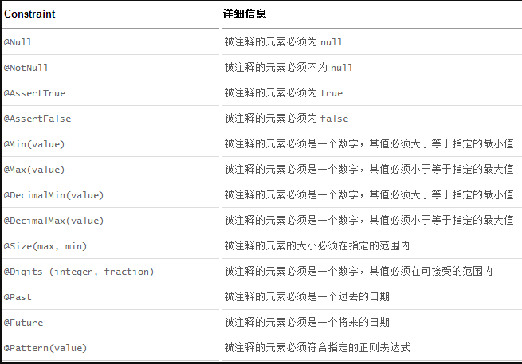
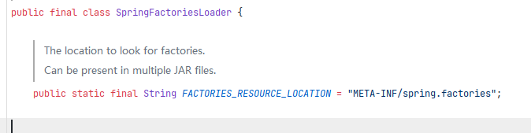
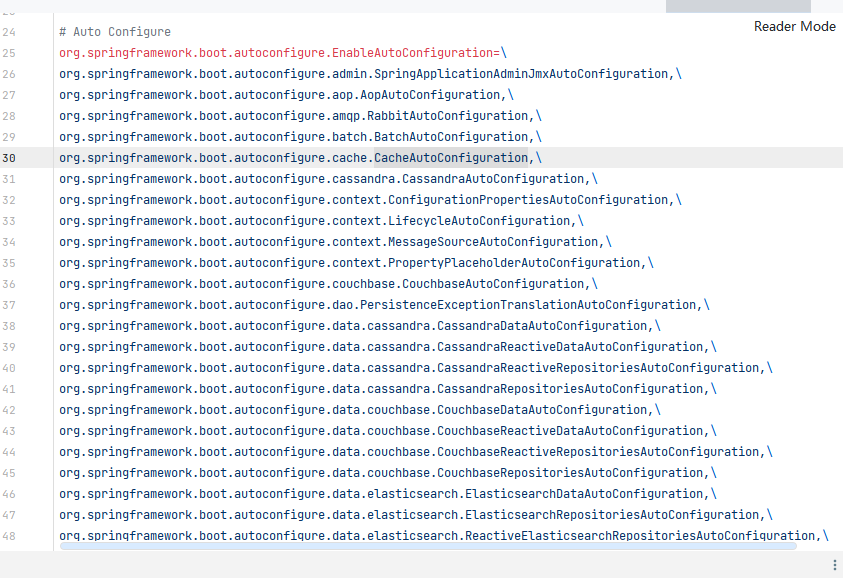
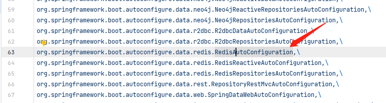
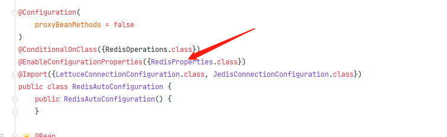
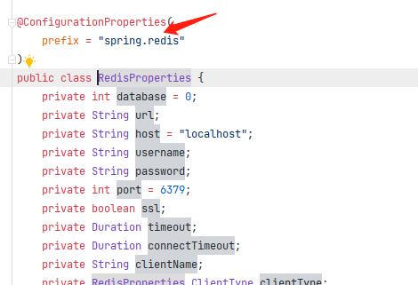

# SpringBoot 学习

## 1. 相关注解

+ **@ConfigurationProperties**, 用于通过读取application.yaml文件对Bean对象注入。假如目标对象不是Bean，则需要 **@EnableConfigurationProperties**注解标记目标class。
```java
/* 对应的application.yml为
dog:
  name: "JoJo"
  age: 133
*/

// 方法一
@Component
@ConfigurationProperties(prefix = "dog")
public class Dog {
    String name;
    int age;
    // Setter
    ...
}

// 方法二
@EnableConfigurationProperties({Dog.class})
@ConfigurationProperties(prefix = "dog")
public class Dog {
    String name;
    int age;
    // Setter
    ...
}
```

+ **@PropertySource**, 用于通过properties文件进行对象注入，需要配合@Value使用(注意：导入的是Spring下的@Value注解)
```java
/* 对应的application.properties为
name=lili
age=122
*/

@Component
@PropertySource("classpath:application.properties")
public class Dog {
    @Value("${name}")
    String name;
    @Value("${age}")
    int age;
    // Setter
    ...
}

```

+ **@Validated**，用于开启JSR 303数据格式验证，**只支持在yaml配置文件场景**
导入依赖：
    ```xml
    <dependency>
        <groupId>org.springframework.boot</groupId>
        <artifactId>spring-boot-starter-validation</artifactId>
    </dependency>

    ```
    

    用法
    ```java
    @Component
    @Validated
   @ConfigurationProperties(prefix = "user")
    public class User {
        @Email(message = "电子邮箱错误")
        String email;
        // Setter
        ...
    }
    ```

+ **@Bean**, 用于配置类@Configuration下, 注解于方法上，生成一个Bean对象

+ **@Import**，用于将第三方类或自定义类导入Bean容器中

+ **@ConditionalOnXXX**，是Spring的底层注解，根据不同的条件来判断当前类或配置是否生效（类比C++的#ifdef宏）

## 2. Spring多环境配置

### 2.1 properties文件方式

在生成环境、测试环境、开发环境的配置不同的情况下，可以使用**spring.profiles.active**来指定配置文件
```java
// resource目录下有三份配置文件

// application.properties
spring.profiles.active=dev

// application-dev.properties
server.port=8081

// application-test.properties
server.port=8082

```

## 2.2 yaml方式
yaml同样可以指定激活哪个配置，通过`---`标记代码分割块实现隔离
```yaml

spring:
  profiles:
    active: dev
---

server:
  port: 8081
spring:
  profiles: dev
---

server:
  port: 8082
spring:
  profiles: test
---

```

## 3. SpringBoot自动配置

自动配置的生效原理：
```
// 调用顺序，自顶向下
@SpringBootApplication
    @EnableAutoConfiguration
        @Import({AutoConfigurationImportSelector.class})
            getAutoConfigurationEntry
                getCandidateConfigurations
                    loadFactoryNames
                        loadSpringFactories
                            Enumeration<URL> urls = classLoader.getResources(FACTORIES_RESOURCE_LOCATION)
```


从代码中可以看出，自动配置的注解会去读取，`META-INF/spring.factories`文件，路径`.m2\repository\org\springframework\boot\spring-boot-autoconfigure\2.5.4\spring-boot-autoconfigure-2.5.4.jar!\META-INF\spring.factories`

该文件下保存了很多自动配置类的路径字符串：


在每个类下面都会使用注解`@EnableConfigurationProperties({xxxProperties.class})`，来注册配置类。而配置类`xxxProperties.class`又会使用注解`@ConfigurationProperties(prefix = "xxx")`来关联配置文件中的字段。比如：




